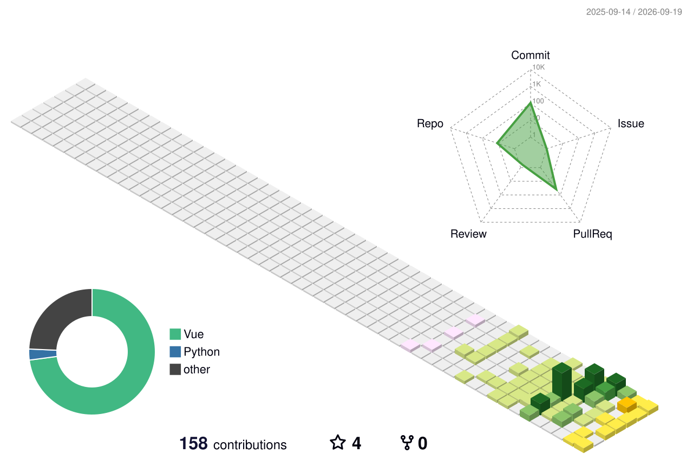

<!-- Header banner, replace with your own image if you like -->
<!--  -->

# 👋 Hi, I'm Atsea_zzZ

---

## 🧑‍💻 About Me

- 🔭 I'm currently focused on **Java backend development**, building microservices with Spring Boot and Spring Cloud.
- 🌱 Diving deeper into **JVM tuning** and **distributed system design**, while keeping an eye on cloud-native technologies.
- 💬 Open to discussions about Java ecosystem, database design, system architecture, and frontend-backend collaboration.
- 📫 Reach me at: `2787220549@qq.com`.
- ⚡ Fun fact: I enjoy exploring CLI tools, self-hosting services, and occasionally writing tech notes.

&nbsp;&nbsp;&nbsp;&nbsp;

---

## 🛠️ Tech Stack & Tools

### Backend

### Frontend

### Infrastructure & Tools

---

## 📊 GitHub Stats

  
  

  

---

## 🌐 3D Contribution Calendar

> Auto-generated by [github-profile-3d-contrib](https://github.com/yoshi389111/github-profile-3d-contrib). Runs daily via GitHub Actions.

  

---

## 📫 Connect with Me

  
  

---

⭐️ From [Atsea_zzZ](https://github.com/AtseazzZ)
